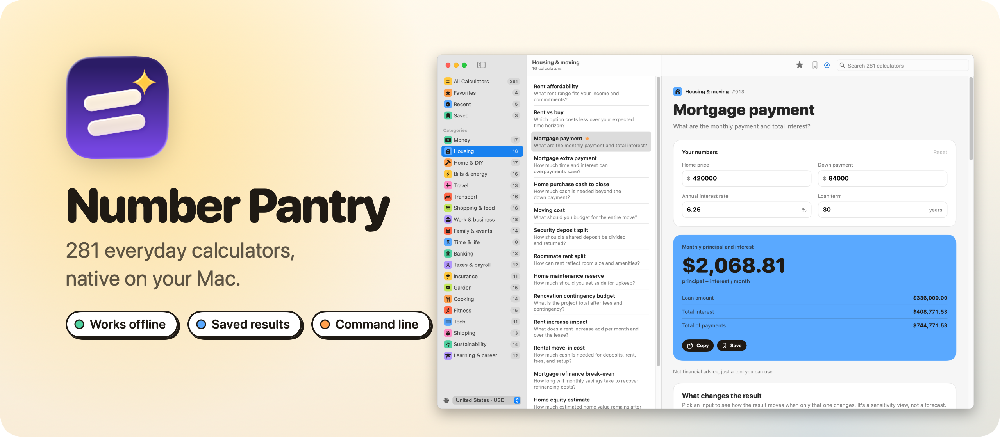
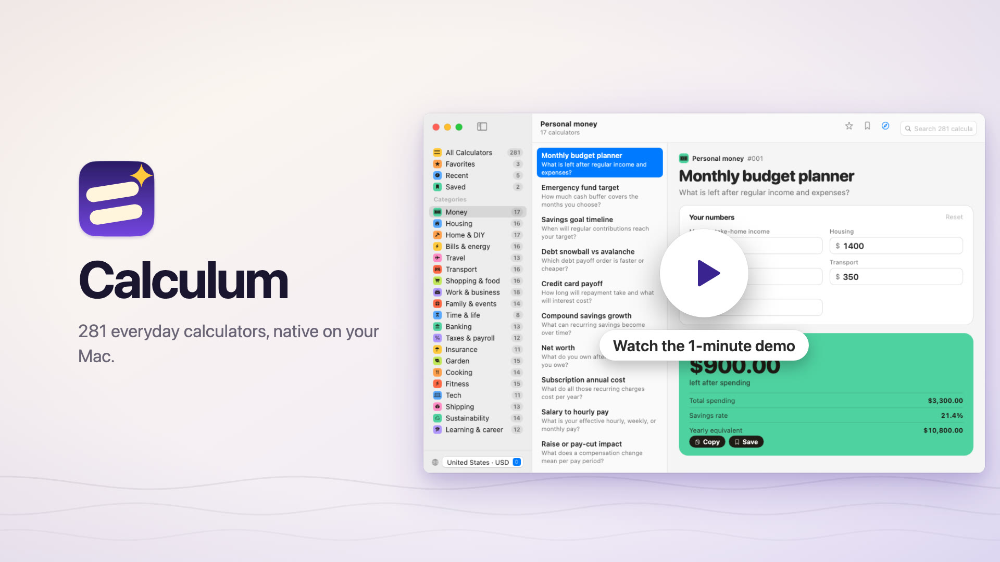
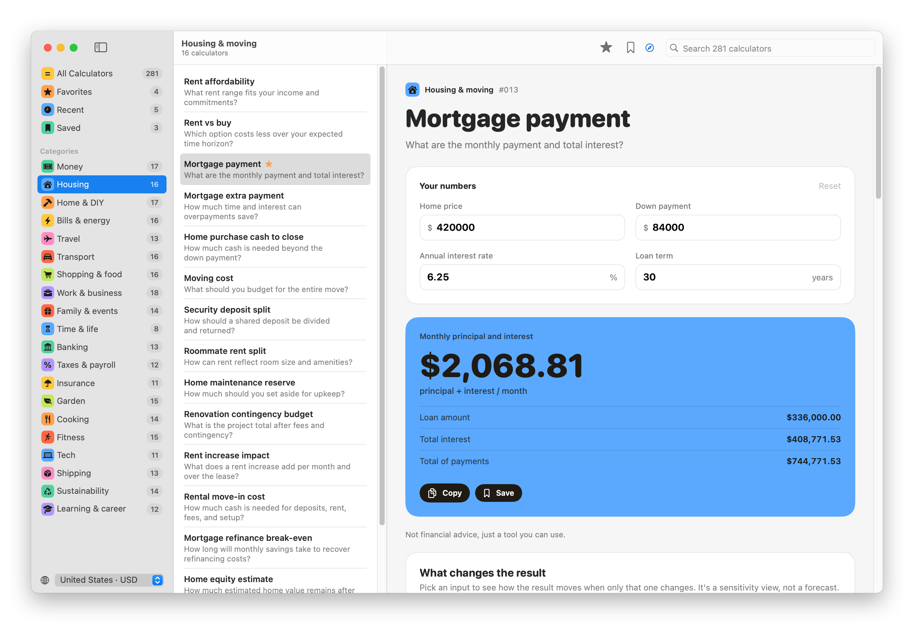
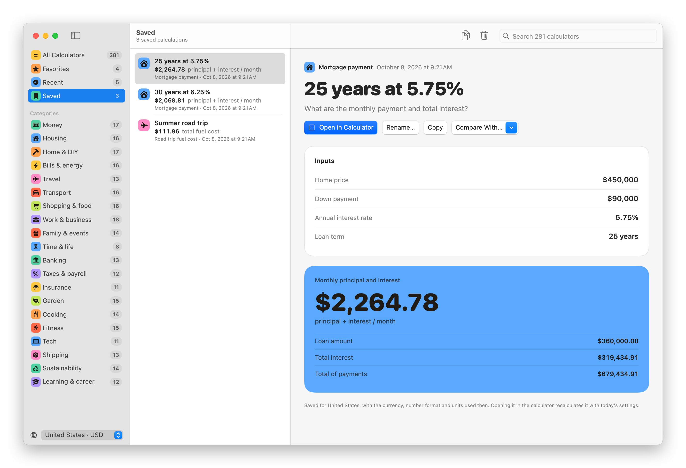
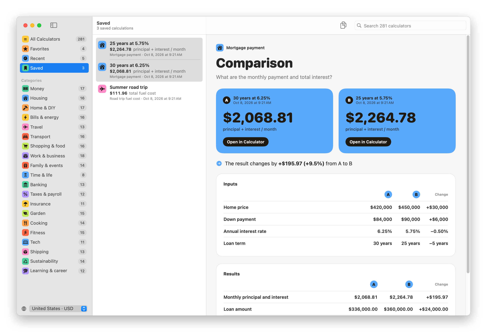

Number Pantry is a free Mac app with 281 calculators for everyday decisions, from rent and mortgages to road trips, paint, payroll and bread dough. Type your numbers and the answer updates as you type, with the formula and the assumptions right next to it.

It's the Mac version of [calculum.dev](https://calculum.dev). The calculators are the same ones, but here they run on your Mac, work offline, and keep your favorites and the calculations you saved. There's a command line tool too, so you can run any calculator from Terminal or a script.

Read the announcement and watch the 1-minute demo on my blog: [I built Number Pantry for Mac, 281 calculators that work offline](https://flaviocopes.com/number-pantry/).

[](https://flaviocopes.com/number-pantry/)

## Download

Get `Number Pantry-1.2.0.zip` from the [latest release](https://github.com/flaviocopes/number-pantry/releases/latest), unzip it, and drag Number Pantry to your Applications folder. It runs on macOS 15 Sequoia or later, on Apple silicon and Intel Macs.

### Opening it the first time

Number Pantry is signed with my Apple Developer ID and notarized by Apple. The first time you open it, macOS asks if you're sure you want to open an app downloaded from the internet. Click **Open**.

On a work laptop you might not be able to install apps in `/Applications`. You can keep Number Pantry in the `Applications` folder inside your home folder instead.

### Updates

Once a day, Number Pantry asks GitHub whether there's a newer version. When there is, it shows what's new, and **Install and Relaunch** puts it in place of the old one. **Number Pantry → Check for Updates…** checks right away.

To turn off the daily check, run this in Terminal:

```sh
defaults write com.flaviocopes.calculum AppUpdaterAutomaticChecks -bool false
```

## Features

- 281 calculators in 20 categories, each with its formula, its assumptions and a guide
- Results that update as you type, with every supporting figure
- A chart of what changes the result, and a projection over time for 26 calculators
- Three realistic examples for every calculator, a click away
- Favorites, recent calculators, and search across everything with ⌘F
- Saved calculations: ⌘S keeps the inputs and the result as a summary you can come back to
- Comparisons of two saved calculations, side by side, with what changed
- 21 countries, with their currency, number format and metric or US customary units
- The `calculum` command, for calculations in Terminal and scripts, with JSON output
- Light and dark appearance, following the macOS setting
- No account, no analytics, and everything works offline

<picture>
  <source media="(prefers-color-scheme: dark)" srcset="docs/screenshot-dark.png" />
  
</picture>

## What's inside

| Category | Calculators | A few of them |
| --- | --- | --- |
| Personal money | 17 | Monthly budget planner, emergency fund target, savings goal timeline, debt snowball vs avalanche |
| Housing & moving | 16 | Rent affordability, rent vs buy, mortgage payment, mortgage extra payment |
| Home projects & DIY | 17 | Paint, flooring, wallpaper, tiles and grout |
| Bills & home energy | 16 | Appliance electricity cost, standby power cost, heating systems, heat pump payback |
| Travel & trips | 13 | Trip budget, daily travel budget, road trip fuel cost, EV road trip charging |
| Transport & cars | 16 | Car affordability, car loan payment, lease vs buy, total cost of ownership |
| Shopping & food | 16 | Unit price comparison, stacked discounts, sales tax or VAT, tip and bill split |
| Work & small business | 18 | Freelance rate, salary vs freelance, project quote, markup vs margin |
| Family, care & events | 14 | Childcare affordability, parental leave budget, child savings goal, wedding budget |
| Time & everyday trade-offs | 8 | Business-day deadline, time saved, hire help vs DIY, pace and distance |
| Banking & borrowing | 13 | Personal loan payment, loan comparison, APY savings growth, early loan payoff |
| Taxes & payroll | 12 | Gross to net pay, payroll withholding, self-employment tax reserve, capital gains tax |
| Insurance & protection | 11 | Deductible vs premium, payment frequency, coverage gap, home contents value |
| Garden & outdoors | 15 | Lawn seed, lawn fertilizer, compost, raised bed soil |
| Cooking & kitchen | 14 | Baker's percentage, dough hydration, yeast scaling, oven energy cost |
| Fitness & activity | 15 | Steps to distance, walking time, running splits, race time predictor |
| Tech & digital life | 11 | Data transfer time, photo storage, cloud storage cost, internet data usage |
| Shipping & logistics | 13 | Dimensional weight, shipping cost, pallet capacity, box fill rate |
| Sustainability & waste | 14 | Vehicle, flight, electricity and home heating emissions |
| Learning & career | 12 | Course return on investment, education cost, study plan, salary offers |

## Using Number Pantry

### Find a calculator

The sidebar has your **Favorites**, the calculators you opened **Recently**, your **Saved** calculations, and the 20 categories, each in its own color. **All Calculators** lists everything, grouped by category.

Press ⌘F to search all 281 at once. Search looks at names, the questions they answer and categories, so typing "split" finds the bill, rent and trip splitters.

Press ⌘D on a calculator to add it to Favorites.

### Enter your numbers

Every calculator opens with realistic example numbers, so you see a result right away. Replace them with yours and the result updates as you type. The units sit next to each field, like `$`, `%`, `years` or `ft`.

Number Pantry remembers the last numbers you typed in each calculator. **Reset** (⌘R) goes back to the example ones.

### Read the result

The result card shows the main answer in big type, with its supporting figures under it, like the loan amount and the total interest for a mortgage. ⇧⌘C copies it all.

Below the result there's more:

- **What changes the result**: pick any input to see how the result moves when only that one changes.
- **Projection over time**: for 26 calculators, like loans, savings and investments, a chart shows how the numbers develop, such as a mortgage's balance falling while the interest adds up.
- **Examples**: three realistic scenarios, each one a click away.
- **How it's calculated**: the formula and the assumptions behind it.
- **Guide**: how to read the result, the edge cases worth checking, what moves the result most, and common mistakes.
- **Sources**: for money, tax, energy and emissions calculators, the official sources behind the definitions and the rules.

### Save a calculation

Press ⌘S, or **Save** on the result card, to save what you calculated. A saved calculation is a summary: the inputs as you entered them and the result with all its details, frozen at that moment.

<picture>
  <source media="(prefers-color-scheme: dark)" srcset="docs/saved-dark.png" />
  
</picture>

Find them in **Saved**, newest first. Give one a name with **Rename…**, copy it as text, delete it, or use **Open in Calculator** to get back into the calculator with those numbers and try something else.

A saved calculation never changes. It keeps the currency, the number format and the units it was saved with, even if you switch country later.

### Compare two calculations

Save two calculations from the same calculator, like a 30-year and a 25-year mortgage, then ⌘-click both in Saved. On a saved calculation you can also use **Compare With…**.

<picture>
  <source media="(prefers-color-scheme: dark)" srcset="docs/compare-dark.png" />
  
</picture>

The comparison puts the two results side by side and tells you how much the result changed, like "+$195.97 (+9.5%)". Then it lists every input and every figure of the result for A and B, with the change next to each one. The rows that differ are in bold. A is the older calculation, B the newer one.

### Countries, currencies and units

Pick your country at the bottom of the sidebar, or in **Settings**. It sets the currency, the number format, and metric or US customary units for every calculator. The 21 countries are the United States, Canada, the United Kingdom, Ireland, Australia, New Zealand, Denmark, Sweden, Norway, Germany, France, Italy, Spain, the Netherlands, Switzerland, India, Japan, Singapore, South Africa, Brazil and Mexico.

Number Pantry never converts currencies or looks up live prices. You enter the amounts, and tax calculators ask for your rates instead of guessing them.

## Keyboard shortcuts

| Shortcut | What it does |
| --- | --- |
| ⌘F | Search all calculators |
| ⌘D | Add the calculator to Favorites, or remove it |
| ⌘S | Save the calculation |
| ⇧⌘C | Copy the result and its details |
| ⌘R | Go back to the example numbers |
| ⌫ | Delete the selected saved calculations |
| ⌘, | Settings |

## The command line tool

The `calculum` command runs the same calculators as the app, so you can get an answer without leaving Terminal, or use one in a script.

### Install it

Choose **Number Pantry → Install Command Line Tool…**. It links `/usr/local/bin/calculum` to the copy inside the app, and asks for your password if that folder needs it. The command stays up to date when the app updates itself.

You can also link it yourself:

```sh
sudo ln -sf "/Applications/Number Pantry.app/Contents/Helpers/calculum" /usr/local/bin/calculum
```

### Use it

Write the calculator, then the inputs you want to change as `name=value`. Inputs you leave out keep their example values.

```sh
calculum mortgage-payment price=450000 rate=5.5
```

```
Mortgage payment

Inputs
  Home price            $450,000
  Down payment          $84,000
  Annual interest rate  5.5%
  Loan term             30 years

Monthly principal and interest
  $2,078.11 principal + interest / month

  Loan amount        $366,000.00
  Total interest     $382,118.79
  Total of payments  $748,118.79
```

`calculum show` tells you the input names of a calculator, what each one is and its example value:

```sh
calculum show mortgage-payment
```

```
Inputs  name, what it is, example value
  price  Home price            $420,000
  down   Down payment          $84,000
  rate   Annual interest rate  6.25%
  years  Loan term             30 years
```

| Command | What it does |
| --- | --- |
| `calculum <calculator> [name=value ...]` | Calculates, with the inputs you give |
| `calculum show <calculator>` | The inputs, their example values, the formula and the assumptions |
| `calculum search <words>` | Finds calculators |
| `calculum list [category]` | Every calculator, or the ones in a category |
| `calculum categories` | The 20 categories |
| `calculum countries` | The countries you can pass to `--country` |

| Option | What it does |
| --- | --- |
| `--country <code>` | The currency, the number format and the units, like `US` or `IT`. It defaults to the country you picked in the app |
| `--json` | Prints JSON, with every input and every figure of the result |
| `-q`, `--quiet` | Prints only the main result |
| `-v`, `--version` | Prints the version |

Values follow the units of the country, so with `--country US` a distance is in feet and with `--country IT` it's in metres. You can write them with a currency symbol or a percent sign, like `'price=$450,000'` or `rate=5.5%`. For an input with a few choices, `show` lists them, and you can pass the number or the start of the label.

A few more examples:

```sh
calculum search split bill
calculum tip-and-bill-split bill=186 people=4 -q        # $58.90
calculum paint-quantity perimeter=16 height=2.7 --country IT
calculum road-trip-fuel-cost --json | jq -r .result.value
calculum list cooking
```

Run `calculum capabilities` for tasks and release history, or add `--json` for the machine-readable manifest.

## Privacy

Every calculation runs on your Mac, so Number Pantry works offline. It goes online in two cases:

- Once a day, it asks GitHub whether there's a newer version of Number Pantry. It downloads one only when you click **Install and Relaunch**.
- When you click a source link or **Open on calculum.dev**, your browser opens that page.

Your favorites, saved calculations and numbers stay in one file on your Mac, `~/Library/Application Support/Calculum/library.json`. **Settings → Show in Finder** opens its folder. There are no accounts and no analytics.

## Estimates, not guarantees

The calculators give planning estimates, and they can be incomplete, outdated or wrong. Check the inputs, the assumptions and your local rules before acting on a result. Nothing in Number Pantry is financial, legal, tax, medical or other professional advice.

## Build it from source

You need macOS 15 or later and Xcode 26. The app icon is an Icon Composer file, and older Xcode versions can't build it.

Open `Calculum.xcodeproj` and press `⌘R`. To build the release zip from the terminal, run:

```sh
scripts/build-release.sh
```

The script builds a universal app in `build/release/Release/Number Pantry.app`, with the `calculum` command inside, signs it with my Developer ID when that certificate is in the keychain, and ad hoc everywhere else, then zips it into `dist/`. When the Developer ID is present, it notarizes the zip with Apple and staples the ticket.

A copy you build yourself opens without a warning on your Mac. If you send it to another Mac, macOS says it "could not verify Number Pantry is free of malware". Click **Done**, then go to **System Settings → Privacy & Security** and click **Open Anyway**.

## Development

```sh
xcodegen generate                  # after editing project.yml
swift scripts/check-engine.swift   # runs every calculator in JavaScriptCore
scripts/test.sh                    # checks the app's models against the engine
scripts/test-cli.sh                # checks the calculum command
swift scripts/render-icon.swift    # the app icon
scripts/screenshot.sh              # the screenshots in docs/
swift scripts/render-banner.swift  # docs/banner.png
```

`Calculum/Resources/engine.js` holds every calculator. It's generated from the calculum.dev source by `scripts/build-engine.sh`, so don't edit it by hand.

Working with an AI coding agent? Point it at [AGENTS.md](AGENTS.md). It has the commands and the rules to follow.

## How it works

The calculators are written in JavaScript, and they're the same code that runs on calculum.dev. Instead of rewriting 281 formulas in Swift, the app bundles them into `engine.js` and runs it in JavaScriptCore, the JavaScript engine built into macOS. So the app, the command line tool and the website give the same answers.

Everything you see is SwiftUI. `Engine.swift` calls the bundle and turns its JSON into Swift types, `AppModel.swift` keeps the open calculator with its result and charts, and `Library.swift` saves your data. The charts use Swift Charts. The `calculum` command is a small Swift program that shares the engine and the models with the app, and ships inside it in `Contents/Helpers`.

## License

[MIT](LICENSE)
